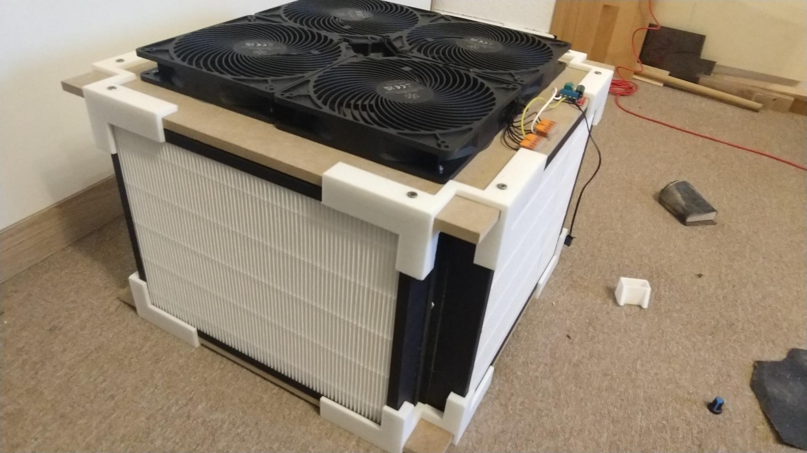

# CR Box

DIY build of a Corsi-Rosenthal box air filter

## Parts

- 4x [Philips AC2889 replacement H13 filters](https://www.kaufland.de/product/469522892)
- 4x SilverStone AP181 180mm fans
- 2x 46.1cm x 46.1cm x 10mm MDF wood (choose a location to buy where they cut your parts as well)
- 1x [brushed motor controller](https://www.amazon.de/gp/product/B07X5JZX4M) or something else doing PWM (if control is necessary)
- 3D printed parts:
    - 8x [outside corners](3d_outside_corner.stl)
    - 8x [indoor corners](3d_inside_corner.stl)
- screws:
    - 32x 4.5x16 wood screws
    - 16x M3 20mm++ thread screws + nuts
- some superglue, WAGO-clamps, power-adapters/step-up/step-down, customizations

## Assembly

1. Insert the outside corners onto the top/bottom plate and screw them in place.
2. Place the air filters on the plate against the outside corners, press the inside-corners lightly but firm against them and glue them in place. After hardening, screw them in. 
3. Place the 4 fans in the middle of the top-plate, mark the cutouts and leave some more space for the bridges pointing in the middle, for stability.
4. Cut via Jigsaw or whatever you have. Does not need to be pretty, but better cut less than more, as you need to fill up anything overcut. 
5. Repeat 1+2 for the bottom plate, cut out all the inside you don't need (reduces weight) and fill with something less heavy than the 10mm MDF (cardboard for example)
6. Prepare the fans electrically by soldering off the fan-speed signal wire (less clutter) and the speed-switch, bridge 1 and 3 as shown in the image to fix fan to full speed. (the image shows the fan-speed signal wire not yet removed, it's the rightmost wire) 
7. Prepare the fans mechanically by cutting off the inside corner, as we need to reach the holes to the middle, otherwise blocked off (or you need a _long_ screw). 
8. Place fans in the middle, ensure nice placement with the holes and drill 16x 3mm holes for the threaded screws, then screw the fans on.
9. Route your fan-wires to a side, make them as pretty as you want and combine into the controller (or directly your power supply).
10. Supply 12V 1.4Amps however you like:
  - [USB-C charger boards](https://www.aliexpress.com/item/1005005324613468.html) are nice, just bridge the 12V pad and you're good. Search AliExpress for "Type C PD2.0 PD3.0 Fast Charge Trigger Polling Detector USB Boost Power Supply Change Module Charger Board"
  - That random 12V supply you have laying around for too long
  - 2x 5V mobile phone chargers (~3.5A needed)
  - An old car battery
  - Anything else you and your step-ups/step-downs you might have are capable of...
  - 
11. [3D Print Controller Case](3d_controllercase.stl) in case you have the exact same thing as I do.

## Finished Assembled

## Finished packed together

